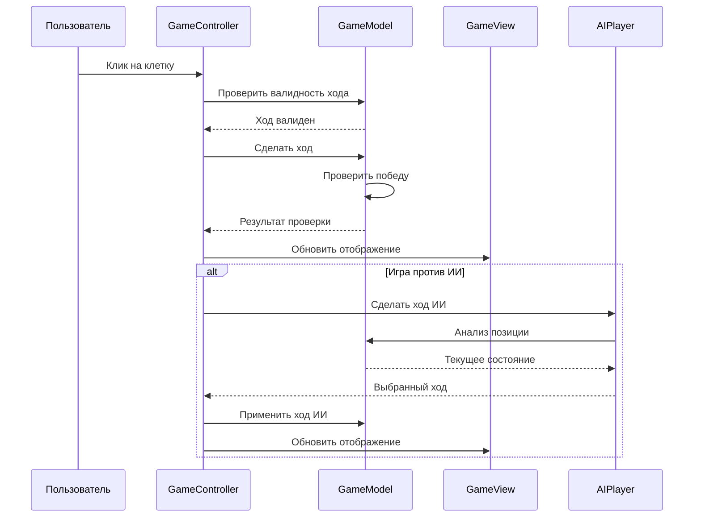

# Проектирование: Игра Гомоку

## Архитектурный обзор

Игра Гомоку реализована как одностраничное веб-приложение (SPA) с клиент-серверной архитектурой. Вся логика игры выполняется на стороне клиента с использованием HTML5, CSS3 и чистого JavaScript. Приложение следует паттерну MVC (Model-View-Controller) для разделения ответственности.

## Компоненты системы

### GameController
- **Ответственность**: Управление игровым процессом, обработка пользовательского ввода
- **Интерфейсы**: startGame(), makeMove(), resetGame(), switchGameMode()
- **Зависимости**: GameModel, GameView, AIPlayer

### GameModel
- **Ответственность**: Хранение состояния игры, логика проверки победы
- **Интерфейсы**: getBoard(), setMove(), checkWin(), isValidMove()
- **Зависимости**: Нет

### GameView
- **Ответственность**: Отрисовка игрового поля и интерфейса
- **Интерфейсы**: renderBoard(), updateCell(), showMessage(), highlightWin()
- **Зависимости**: DOM API

### AIPlayer
- **Ответственность**: Алгоритм ИИ для игры против компьютера
- **Интерфейсы**: makeMove(), evaluatePosition()
- **Зависимости**: GameModel

### ConfigManager
- **Ответственность**: Управление настройками игры
- **Интерфейсы**: setBoardSize(), setGameMode(), saveSettings()
- **Зависимости**: localStorage API

## Диаграмма последовательности



## Модели данных

### GameState
```json
{
  "board": "2D массив состояний клеток",
  "currentPlayer": "number (1 или 2)",
  "gameMode": "string ('human' или 'ai')",
  "boardSize": "number (15 или 19)",
  "gameStatus": "string ('playing', 'won', 'draw')",
  "winner": "number или null",
  "winLine": "array координат победной линии"
}
```

### Cell
```json
{
  "row": "number",
  "col": "number", 
  "player": "number (0-пусто, 1-черный, 2-белый)",
  "isHighlighted": "boolean"
}
```

### Move
```json
{
  "row": "number",
  "col": "number",
  "player": "number",
  "timestamp": "number"
}
```

## Обработка ошибок

| Код ошибки | Описание | Действие |
|------------|----------|----------|
| ERR-001 | Клетка уже занята | Показать уведомление, не делать ход |
| ERR-002 | Игра уже завершена | Показать уведомление о завершенной игре |
| ERR-003 | Неверные координаты | Игнорировать клик |
| ERR-004 | Ошибка ИИ | Показать ошибку, позволить ручной ход |

## Алгоритм ИИ

### Базовый уровень (Минимакс с ограниченной глубиной)

1. **Оценка позиции**: 
   - +1000 за линию из 5 фишек
   - +100 за открытую линию из 4
   - +50 за закрытую линию из 4
   - +10 за открытую линию из 3
   - +5 за закрытую линию из 3

2. **Стратегии**:
   - Немедленная победа (5 в ряд)
   - Блокировка победы противника
   - Создание двойных угроз
   - Захват центра поля

3. **Глубина поиска**: 2-4 уровня в зависимости от сложности

## Соображения по безопасности

- Валидация всех пользовательских вводов
- Защита от XSS через использование textContent вместо innerHTML
- Ограничение размера игрового поля (максимум 25x25)
- Таймауты для алгоритмов ИИ для предотвращения зависания

## Стратегия тестирования

### Модульные тесты
- Тестирование логики проверки победы
- Тестирование валидации ходов
- Тестирование алгоритма ИИ
- Тестирование сохранения/загрузки состояния

### Интеграционные тесты
- Тестирование полного игрового цикла
- Тестирование взаимодействия пользователя
- Тестирование адаптивности интерфейса
- Кроссбраузерное тестирование

## Структура файлов

```
gomoku-game/
├── index.html          # Основная HTML страница
├── css/
│   ├── styles.css      # Основные стили
│   └── responsive.css  # Адаптивные стили
├── js/
│   ├── game-controller.js  # Контроллер игры
│   ├── game-model.js       # Модель игры
│   ├── game-view.js        # Представление
│   ├── ai-player.js        # ИИ игрок
│   └── config-manager.js   # Менеджер настроек
└── specs/              # Спецификации
    ├── requirements.md
    ├── design.md
    └── tasks.md
```

## Производительность

- Оптимизация алгоритма проверки победы O(1) вместо O(n²)
- Кэширование оценки позиций для ИИ
- Ленивая загрузка компонентов
- Минимизация DOM операций

## Масштабируемость

- Модульная архитектура позволяет легко добавлять новые функции
- Конфигурируемые размеры игрового поля
- Расширяемая система ИИ (различные уровни сложности)
- Поддержка локализации интерфейса
